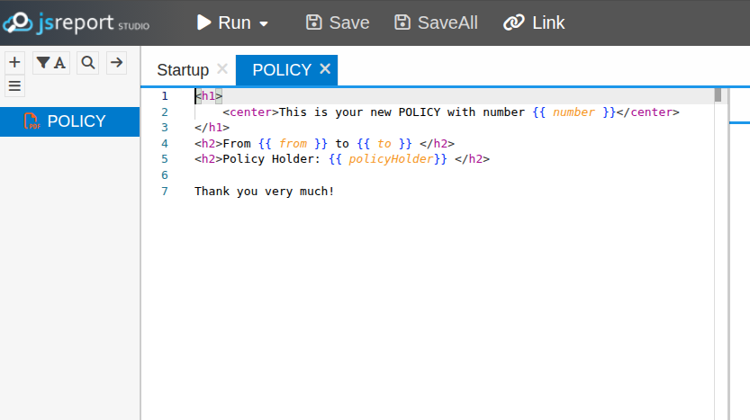

# Cluster Apps How-To's

<!-- START doctoc generated TOC please keep comment here to allow auto update -->
<!-- DON'T EDIT THIS SECTION, INSTEAD RE-RUN doctoc TO UPDATE -->
**Table of Contents**

- [QA—Observability](#qaobservability)
  - [Prometheus & Grafana](#prometheus--grafana)
  - [Zipkin](#zipkin)
- [Data](#data)
  - [Postgres](#postgres)
  - [MongoDB](#mongodb)
  - [Elasticsearch](#elasticsearch)
  - [MinIO](#minio)
  - [Kafka](#kafka)
- [Services](#services)
- [Cluster Load Monitoring](#cluster-load-monitoring)
  - [Local Dev (Kind)](#local-dev-kind)
  - [QA (K3s)](#qa-k3s)

<!-- END doctoc generated TOC please keep comment here to allow auto update -->

Use the following sequence of [Make](https://www.gnu.org/software/make/) targets and shell commands
to deploy cluster apps including infrastructure and "Insurance Hub" services.

> ⚠️ Arguments in square brackets are optional. When omitted, the default value is used. The
> default value can be found by searching argument name in the corresponding `Makefile`.

## QA—Observability

- `cd k8s`

### Prometheus & Grafana

- `make prometheus-stack-install`
- `make prometheus-stack-status`
- `kubectl get pods -n qa-monitoring | grep prometheus`
    ```shell
    NAME                                                     READY   STATUS    RESTARTS   AGE
    alertmanager-qa-prometheus-kube-prometh-alertmanager-0   2/2     Running   0          4m29s
    prometheus-qa-prometheus-kube-prometh-prometheus-0       2/2     Running   0          4m29s
    qa-prometheus-grafana-6595b55444-tlb9t                   3/3     Running   0          5m28s
    qa-prometheus-kube-prometh-operator-779bb6fd9c-5lthm     1/1     Running   0          5m28s
    qa-prometheus-kube-state-metrics-79cf8d8f9b-dqgm7        1/1     Running   0          5m28s
    qa-prometheus-prometheus-node-exporter-97p7f             1/1     Running   0          5m28s
    qa-prometheus-prometheus-node-exporter-hn696             1/1     Running   0          5m28s
    qa-prometheus-prometheus-node-exporter-zcd5z             1/1     Running   0          5m28s    
    ```
- **QA/Snapshot**: `make -C bootstrap qa-nodes-snapshot QA_SNAPSHOT_NAME=observability-install-<iso-date>`

### Zipkin

- **Prerequisites**: [Elasticsearch](#elasticsearch) 
- `make zipkin-es-user-secret-create`
- `make zipkin-es-user-create`
- `make zipkin-install`
- `make zipkin-status`
- `make zipkin-ui` and go to `http://localhost:9411`
- **QA/Snapshot**: `make -C bootstrap qa-nodes-snapshot QA_SNAPSHOT_NAME=zipkin-install-<iso-date>`

## Data

Deploy the necessary data resources into the either `local-dev-all` or `qa-data` namespaces.

### Postgres

- `make postgres-operator-deploy`

  1. **auth** service: 
  - `make postgres-svc-secret-create SVC_NAME=auth [PG_SVC_USER_PWD=<user-pwd>]`
  - `make postgres-svc-deploy SVC_NAME=auth`, wait at least one minute for the cluster to be ready.
  
  2. **document** service: 
  - `make postgres-svc-secret-create SVC_NAME=document [PG_SVC_USER_PWD=<user-pwd>]`
  - `make postgres-svc-deploy SVC_NAME=document`, wait at least one minute for the cluster to be ready.
  
  3. **payment** service: 
  - `make postgres-svc-secret-create SVC_NAME=payment [PG_SVC_USER_PWD=<user-pwd>]`
  - `make postgres-svc-deploy SVC_NAME=payment`, wait at least one minute for the cluster to be ready.
  
  4. **policy** service: 
  - `make postgres-svc-secret-create SVC_NAME=policy [PG_SVC_USER_PWD=<user-pwd>]`
  - `make postgres-svc-deploy SVC_NAME=policy`

  5. **pricing** service:
  - `make postgres-svc-secret-create SVC_NAME=pricing [PG_SVC_USER_PWD=<user-pwd>]`
  - `make postgres-svc-deploy SVC_NAME=pricing`, wait at least one minute for the cluster to be ready.

  6. **product** service: 
  - `make postgres-svc-secret-create SVC_NAME=product [PG_SVC_USER_PWD=<user-pwd>]`
  - `make postgres-svc-deploy SVC_NAME=product`, wait at least one minute for the cluster to be ready.

- `kubectl get pods -n qa-data | grep postgres`
    ```shell
    NAME                     READY   STATUS    RESTARTS   AGE
    qa-postgres-auth-1       1/1     Running   0          47m
    qa-postgres-auth-2       1/1     Running   0          45m
    qa-postgres-document-1   1/1     Running   0          36m
    qa-postgres-document-2   1/1     Running   0          35m
    qa-postgres-payment-1    1/1     Running   0          28m
    qa-postgres-payment-2    1/1     Running   0          27m
    qa-postgres-policy-1     1/1     Running   0          11m
    qa-postgres-policy-2     1/1     Running   0          11m
    qa-postgres-product-1    1/1     Running   0          9m
    qa-postgres-product-2    1/1     Running   0          9m
    qa-postgres-pricing-1    1/1     Running   0          4m
    qa-postgres-pricing-2    1/1     Running   0          4m
    ```
- **QA**: `make grafana-ui`
- **QA/Grafana**: In _Dashboards > New > Import_, add the "CloudNativePG" dashboard using the following
  URL: https://grafana.com/grafana/dashboards/20417-cloudnativepg/.
- **QA/Snapshot**: `make -C bootstrap qa-nodes-snapshot QA_SNAPSHOT_NAME=postgres-deploy-<iso-date>`

### MongoDB

- `make mongodb-operator-install`
- `make mongodb-root-user-secret-create [MONGO_ROOT_USER_PWD=<user-pwd>]`
- `make mongodb-product-user-secret-create [MONGO_PRODUCT_USER_PWD=<product-pwd>]`
- `make mongodb-deploy`
- `make mongodb-status`  
- **QA**: `make -C bootstrap qa-nodes-snapshot QA_SNAPSHOT_NAME=mongodb-deploy-<iso-date>`

### Elasticsearch

- `make es-operator-deploy`
- `make es-deploy`
- `make es-status`
- **QA**: `make es-exporter-deploy`
- **QA**: `make grafana-ui`
- **QA/Grafana**: In _Dashboards > New > Import_, add the "ElasticSearch" dashboard using the following
  URL: https://grafana.com/grafana/dashboards/2322-elasticsearch/.
- **QA/Snapshot**: `make -C bootstrap qa-nodes-snapshot QA_SNAPSHOT_NAME=elasticsearch-deploy-<iso-date>`

### MinIO

- `make minio-operator-deploy`
  
  1. **document** service:
  - `make minio-storage-user-secret-create SVC_NAME=document [MINIO_CONSOLE_ACCESS_KEY=<access-key>] [MINIO_CONSOLE_SECRET_KEY=<secret-key>]`
  - `make minio-storage-config-secret-create SVC_NAME=document [MINIO_ROOT_USER=<user-name>] [MINIO_ROOT_USER_PWD=<user-pwd>]`
  - `make minio-tenant-deploy SVC_NAME=document`
  - `make minio-tenant-status SVC_NAME=document`
  - `make minio-svc-bucket-create SVC_NAME=document BUCKET_NAME=policies`
  - `make minio-svc-user-secret-create SVC_NAME=document [MINIO_SVC_ACCESS_KEY=<access-key>] [MINIO_SVC_SECRET_KEY=<secret-key>]`
  - `make minio-svc-user-with-policy-create SVC_NAME=document POLICY_FILE=apps/svc/document/minio/s3-policy-policies.json`

  2. **payment** service:
  - `make minio-storage-user-secret-create SVC_NAME=payment [MINIO_CONSOLE_ACCESS_KEY=<access-key>] [MINIO_CONSOLE_SECRET_KEY=<secret-key>]`
  - `make minio-storage-config-secret-create SVC_NAME=payment [MINIO_ROOT_USER=<user-name>] [MINIO_ROOT_USER_PWD=<user-pwd>]`
  - `make minio-tenant-deploy SVC_NAME=payment`
  - `make minio-tenant-status SVC_NAME=payment`
  - `make minio-svc-bucket-create SVC_NAME=payment BUCKET_NAME=payments-import`
  - `make minio-svc-user-secret-create SVC_NAME=payment [MINIO_SVC_ACCESS_KEY=<access-key>] [MINIO_SVC_SECRET_KEY=<secret-key>]`
  - `make minio-svc-user-with-policy-create SVC_NAME=payment POLICY_FILE=apps/svc/payment/minio/s3-policy-payments-import.json`

- **QA/Grafana**: In _Dashboards > New > Import_, add dashboards using the following URLs: 
    - https://grafana.com/grafana/dashboards/13502-minio-dashboard/
    - https://grafana.com/grafana/dashboards/19237-minio-bucket-dashboard/
- **QA/Snapshot**: `make -C bootstrap qa-nodes-snapshot QA_SNAPSHOT_NAME=minio-deploy-<iso-date>`

### Kafka
- `make kafka-strimzi-operator-install`
- `make kafka-deploy`
- `make kafka-status`
- **QA/Grafana**: `make grafana-ui`
- **QA/Grafana**: In _Dashboards > New > Import_, add the "Strimzi Kafka" dashboard using the
  following [JSON](https://github.com/strimzi/strimzi-kafka-operator/blob/0.48.0/examples/metrics/grafana-dashboards/strimzi-kafka.json) file
- **QA/Snapshot**: `make -C bootstrap qa-nodes-snapshot QA_SNAPSHOT_NAME=elasticsearch-deploy-<iso-date>`

## Services

Deploy the necessary data resources into the either `local-dev-all` or `qa-svc` namespaces.

- `cd ..` - from the project root
- `make java-all-build`
- `make frontend-build`
- `make docker-frontend-build`
- `cd k8s`
- `make svc-image-local-dev-load SVC_NAME=web-vue`
- `make svc-image-qa-load SVC_NAME=web-vue`

**Until Docker images publishing to a registry is implemented, for all services, except `jsreport`**:
- `cd ..` - from the project root
- `make docker-java-svc-build SVC_NAME=<svc-name>`
- `cd k8s`
- `make svc-image-local-dev-load SVC_NAME=<svc-name>` 
- `make svc-image-qa-load SVC_NAME=<svc-name>`

**1. jsreport**

- `make jsreport-deploy`
- `kubectl get pods -n local-dev-all | grep jsreport`
    ```shell
    local-dev-jsreport-5548585d57-q5sdc   1/1     Running   0          47s
    ```
- `make jsreport-status`
- `make jsreport-ui` and go to `http://localhost:5488`
- Go to jsreport UI at http://localhost:5488 and add a new template(legacy/documents-service/src/main/resources/policy.template) for generating policy PDF.

  
- **QA/Snapshot**: `make -C bootstrap qa-nodes-snapshot QA_SNAPSHOT_NAME=jsreport-deploy-<iso-date>``

**2. web-vue**

- `make svc-deploy SVC_NAME=web-vue`

**3. agent-portal-getaway**

- `make svc-deploy SVC_NAME=agent-portal-gateway`

**4. auth**

- `make svc-deploy SVC_NAME=auth`

**5. document**

- `make minio-console-ui SVC_NAME=document`
  - Go to `http://localhost:9090`
  - Log in with the credentials provided in the `minio-svc-user-secret-create` target.
- `make svc-deploy SVC_NAME=document` 
- **QA/Snapshot**: `make -C bootstrap qa-nodes-snapshot QA_SNAPSHOT_NAME=document-deploy-<iso-date>``

**6. payment**

- `make minio-console-ui SVC_NAME=payment`
    - Go to `http://localhost:9090`
    - Log in with the credentials provided in the `minio-svc-user-secret-create` target.
- `make svc-deploy SVC_NAME=payment`
- **QA/Snapshot**: `make -C bootstrap qa-nodes-snapshot QA_SNAPSHOT_NAME=payment-deploy-<iso-date>``

**7. product**

- `make svc-deploy SVC_NAME=product`

**8. policy-search**

- Built-in Elasticsearch's user `elastic` is used for the service. Therefore, no additional user
  secrets are required.
- `make svc-deploy SVC_NAME=policy-search`

**9. dashboard**
- Built-in Elasticsearch's user `elastic` is used for the service. Therefore, no additional user
  secrets are required.
- `make svc-deploy SVC_NAME=dashboard`

**10. policy**

- `make svc-deploy SVC_NAME=policy`

**11. pricing**

- `make svc-deploy SVC_NAME=pricing`

**12. chat**

- `make svc-deploy SVC_NAME=chat`

## Cluster Load Monitoring

### Local Dev (Kind)

- `kubectl get apiservice v1beta1.metrics.k8s.io` to verify that the Metrics API service is available.
- `kubectl get nodes`
- `kubectl top pods -A` to verify workload metrics.

### QA (K3s)

1. **Prometheus**

- `cd k8s`
- `make prometheus-ui` and go to `http://localhost:9090`
- In Prometheus UI, go to `Status -> Target Health` and verify that all targets are `UP`

2. **Grafana**

- `make grafana-ui` and go to `http://localhost:3000`
- In Grafana UI, go to `Home -> Manage -> Dashboard` and verify that the default dashboards are
  available:
    - Kubernetes / Compute Resources / Cluster
    - Kubernetes / Compute Resources / Node
    - Kubernetes / Compute Resources / Pod
    - etc.

3. **htop & df**

- `kubectl get nodes`
- `lxc exec <node-name> -- /bin/bash`
    ```shell
    lxc exec qa-master -- /bin/bash
    root@qa-master:~# htop
    root@qa-master:~# df -h
    ```
- Verify node capacity and limits:
    ```shell
    kubectl get nodes -o jsonpath='{range .items[*]}{.metadata.name}: {.status.allocatable.cpu}{"\n"}{end}'
    qa-master: 6
    qa-worker1: 3
    qa-worker2: 3
    ```
- Check current pod CPU usage:
    ```shell
    kubectl top nodes
    kubectl top pod --all-namespaces  
    ```
