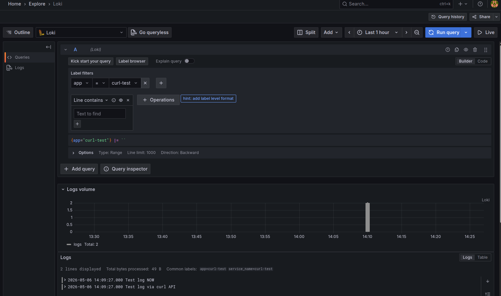
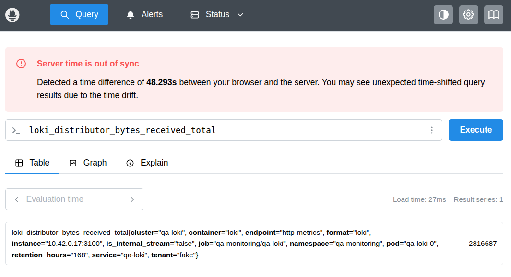

## Verify Loki Logs

### QA

This runbook validates that Loki in `qa-monitoring` is healthy, receives logs via **HTTP push API**, stores data in the Loki MinIO bucket, and is queryable via curl and MinIO UI.

> This test uses direct HTTP push to `/loki/api/v1/push` (no collector required). Logs persist to MinIO chunks/index objects.

1. **Verify Loki workload health**

   ```shell
   cd k8s
   make loki-status
   ```

   **Expected**: `qa-loki-0` and `loki-canary-*` pods are `Running`.

2. **Verify Loki readiness endpoint**

   In one terminal:

   ```shell
   make loki-ui
   ```

   In another terminal:

   ```shell
   curl -sf http://localhost:3100/ready && echo "Loki is ready"
   ```

   **Expected**: `Loki is ready`

3. **Verify MinIO tenant + credentials for Loki**

   ```shell
   make minio-tenant-status SVC_NAME=loki
   kubectl get secret qa-minio-loki-svc-user-creds -n qa-minio-loki
   kubectl get secret qa-minio-loki-svc-user-creds -n qa-monitoring
   ```

4. **Push and verify test logs via Loki HTTP API**

   ```shell
   # Push
   TS=$(date -u +%s000000000)
   curl -s -H "Content-Type: application/json" -X POST "http://localhost:3100/loki/api/v1/push" \
     --data-raw "{\"streams\":[{\"stream\":{\"app\":\"curl-test\",\"namespace\":\"qa-svc\"},\"values\":[[\"$TS\",\"Test log via curl API\"]]}]}"

   # Verify
   sleep 10
   START=$(date -d '1 hour ago' +%s)
   END=$(date +%s)
   curl -G "http://localhost:3100/loki/api/v1/query_range" \
     --data-urlencode "query={app=\"curl-test\"}" \
     --data-urlencode "start=$START" \
     --data-urlencode "end=$END" \
     --data-urlencode 'limit=10' | jq '.data.result[]?'
   ```

   **Expected**: 
   
   ```json
   {
     "stream": {
       "app": "curl-test",
       "detected_level": "unknown",
       "namespace": "qa-svc",
       "service_name": "curl-test"
     },
     "values": [
       [
         "1778090967000000000",
         "Test log via curl API"
       ]
     ]
   }
   ```

5. **Verify bucket object presence in MinIO**

   In one terminal:

   ```shell
   make minio-console-ui SVC_NAME=loki
   ```

   Open `https://localhost:9443`, log in with Loki MinIO credentials, navigate to `loki-logs` (or
   configured bucket), confirm new `fake/` and `index/` objects created post-step 4.

6. **Verify Grafana Loki datasource (optional)**

   ```shell
   make grafana-ui
   ```

   In Grafana (`http://localhost:3000`), Explore → Loki → `{app="curl-test"}`.

   **Expected**:

   

7. **Verify Loki metrics in Prometheus (optional)**

   ```shell
   make prometheus-ui
   ```

   In Prometheus (`http://localhost:9090`), query `loki_distributor_bytes_received_total`.

   **Expected**:

   
