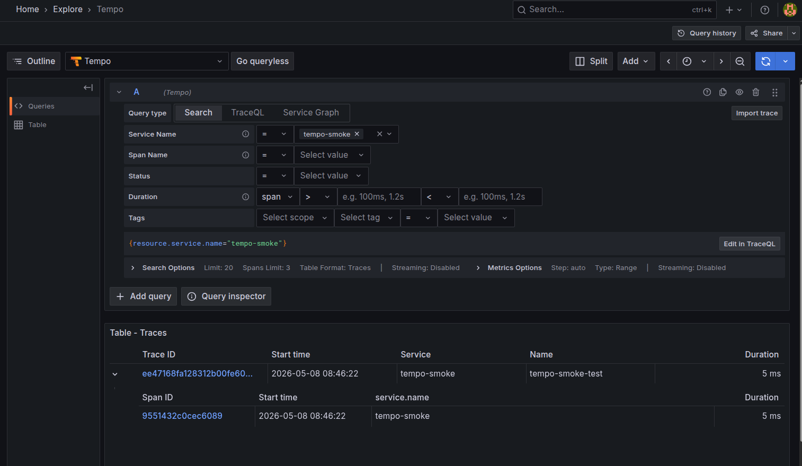
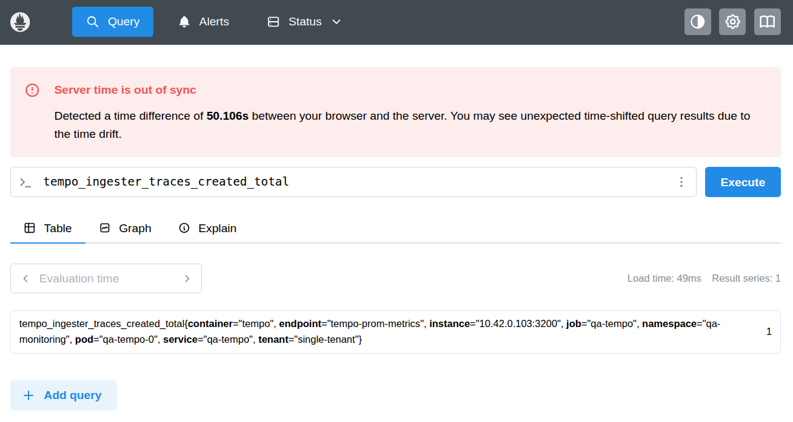

## Verify Tempo Traces

### QA

This runbook validates that Tempo in `qa-monitoring` is healthy, receives traces, stores data in the
Tempo MinIO bucket, and is queryable via API and Grafana.

> This test uses direct Zipkin v2 span ingestion to Tempo (`/api/v2/spans`) and then fetches the
> trace by ID from Tempo (`/api/traces/<trace-id>`).

1. **Verify Tempo workload health**

   ```shell
   cd k8s
   make tempo-status
   ```

   **Expected**: `qa-tempo-0` pod is `Running`.

2. **Verify Tempo readiness endpoint**

   In one terminal:

   ```shell
   make tempo-ui
   ```

   In another terminal:

   ```shell
   curl -sf http://localhost:3200/ready && echo "Tempo is ready"
   ```

   **Expected**: `Tempo is ready`

3. **Verify MinIO tenant + credentials for Tempo**

   In another terminal:
   ```shell
   kubectl port-forward svc/qa-tempo 4318:4318 -n qa-monitoring
   ```

   ```shell
   make minio-tenant-status SVC_NAME=tempo
   kubectl get secret qa-minio-tempo-svc-user-creds -n qa-minio-tempo
   kubectl get secret qa-minio-tempo-svc-user-creds -n qa-monitoring
   ```

4. **Push and verify a synthetic trace**

   ```shell
   TRACE_ID=$(python3 -c 'import secrets; print(secrets.token_hex(16))'); \
     SPAN_ID=$(python3 -c 'import secrets; print(secrets.token_hex(8))'); \
     TS=$(python3 -c 'import time; print(int(time.time()*1_000_000))'); \
     curl -s http://localhost:4318/v1/traces -H 'Content-Type: application/json' -d '{"resourceSpans":[{"resource":{"attributes":[{"key":"service.name","value":{"stringValue":"tempo-smoke"}}]},"scopeSpans":[{"scope":{"name":"smoke"},"spans":[{"traceId":"'"$TRACE_ID"'","spanId":"'"$SPAN_ID"'","name":"tempo-smoke-test","kind":"SPAN_KIND_INTERNAL","startTimeUnixNano":"'"$((TS*1000))"'","endTimeUnixNano":"'"$((TS*1000+5000000))"'"}]}]}]}'   # Verify trace is retrievable by trace ID
   sleep 10
   curl -s "http://localhost:3200/api/traces/$TRACE_ID" | jq '.batches[0].resource.attributes'
   ```

   **Expected**: `{"partialSuccess":{}}`

5. **Verify bucket object presence in MinIO**

   In one terminal:

   ```shell
   make minio-console-ui SVC_NAME=tempo
   ```

   Open `https://localhost:9443`, log in with Tempo MinIO credentials, navigate to `tempo-traces`
   bucket, confirm objects are present/updated after step 4.

6. **Verify Grafana Tempo datasource**

   ```shell
   make grafana-ui
   ```

   In Grafana (`http://localhost:3000`), Explore → Tempo → Query type → Search →
   `{resource.service.name="tempo-smoke"}`.

   **Expected**: 

   

7. **Verify Tempo metrics in Prometheus (optional)**

   ```shell
   make prometheus-ui
   ```

   In Prometheus (`http://localhost:9090`), run:
   - `tempo_distributor_spans_received_total`
   - `tempo_ingester_traces_created_total`

   **Expected**: 

   

   
