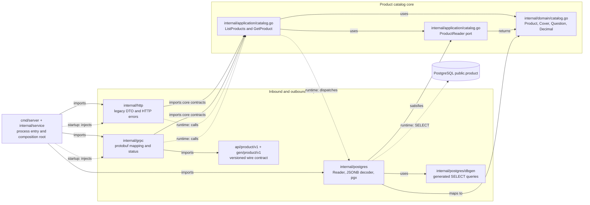

# Product catalog read service

This standalone module is the Go Product pilot. Its executable serves the direct Product HTTP API,
the generated Product v1 gRPC API, and management health routes from one explicit composition root.
It uses one process-owned PostgreSQL pool for catalog reads and dependency-aware readiness. The
service remains an internal migration candidate; do not route production Product traffic to it.

The module path is
`github.com/igor-baiborodine/insurance-hub/services/product-service`. It resolves with
`GOWORK=off` and has no filesystem replacement or dependency on the scaffold module. Go 1.27.2 is
required. From the repository root, use its owning Makefile:

```sh
make go-product-bootstrap-tools
make -C services/product-service format FORMAT_SCOPE=all
make -C services/product-service check FORMAT_SCOPE=all
make go-product-test-tooling
make -C services/product-service build
make -C services/product-service check-docs
```

`go-product-bootstrap-tools` installs the pinned Go generators/checkers and Mermaid renderer under
the ignored `services/product-service/.tools/` directory. To start the service, have the approved
local secret mechanism export the restricted reader URL, then invoke the owning target without
putting the value in this file or the command line:

```sh
# PRODUCT_DATABASE_URL is already exported by the approved local secret source.
make -C services/product-service run
```

The Product check requires a working Docker daemon. Integration tests pin Testcontainers Go
v0.44.0 and `postgres:17.10-alpine` at digest
`sha256:742f40ea20b9ff2ff31db5458d127452988a2164df9e17441e191f3b72252193`, create an isolated
`product_test` database, and remove it
after the run:

```sh
make -C services/product-service test-integration INTEGRATION_SUITE=harness FIXTURE_SET=qa
```

`INTEGRATION_SUITE` accepts `harness`, `reader`, `grpc`, `http`, `startup`, `parity`,
`cancellation`, `lifecycle`, `read-only`, `access`, or `all`.
`FIXTURE_SET` accepts only `qa`, the
production-like snapshot captured by issue 131; the local-dev snapshot is intentionally excluded.
The selector never connects to the QA environment. Empty or unknown selectors, unavailable Docker,
missing fixtures, zero selected tests, and any configured `PRODUCT_DATABASE_URL` fail the target.
The harness resolves and reads the accepted QA snapshot directly under
`legacy/product-service/src/test/resources/product-read-baseline/` without copying or changing
it. Its setup identity creates the legacy table and `go_product_reader`; service tests receive only
the generated reader URL.

The reader integration suite uses the same disposable database and QA snapshot:

```sh
make -C services/product-service test-integration INTEGRATION_SUITE=reader FIXTURE_SET=qa
```

The reader uses sqlc v1.31.1 with pgx v5.11.0. Its source-only schema and parameterized list/get
queries are under `internal/postgres/sql`; generated code is under `internal/postgres/dbgen`. The
schema file describes the existing Java-owned table for generation and tests. The service never
executes it at runtime. Use `gen-sql` only when intentionally changing SQL inputs; `check-sql-drift`
verifies the exact output set, source preservation, and byte-reproducible generation.

The direct HTTP boundary is exercised on a real loopback listener with test-owned callbacks:
`make -C services/product-service test TEST_PACKAGES=./internal/http`. The `startup` integration
suite exercises the production composition path, all three listeners, empty-table health,
dependency loss/recovery, startup failures, and resource cleanup.

The `parity` suite uses that production composition path to replay the immutable QA catalog, every
accepted synthetic data-edge case, and every direct Product failure case through its applicable
HTTP and gRPC boundary. The malformed URI case is HTTP-only because gRPC has no URI parser. The two
SQL-null cases remain database-constraint checks and must fail with SQLSTATE `23502`.

The `cancellation` suite uses deterministic PostgreSQL table locks and a one-connection runtime
pool to prove caller cancellation, configured and caller deadlines, bounded acquisition, HTTP
disconnect propagation, backend-connection loss, probe behavior, connection release, and
subsequent recovery. It controls only its disposable database and does not use timing sleeps.

The `lifecycle` suite launches the race-built production executable and sends it `SIGTERM`. It
proves bounded idle shutdown, graceful completion of accepted HTTP and gRPC work, forced
termination of blocked work after the drain period, rejection of new work during shutdown, and
release of listeners and PostgreSQL connections within the one configured shutdown budget.

The Product v1 schema is `api/product/v1/product_service.proto`; generated Go bindings are under
`gen/product/v1`. The frozen initial compatibility baseline lives in
`testdata/contract-baseline`, separate from the scaffold Echo baseline. Use `format-proto`,
`update-proto-deps`, and `gen-proto` only when intentionally changing the schema or generated
output; `check` verifies format, lint, reproducible generation, and breaking compatibility.

`bootstrap-tools`, `update-deps`, `format`, and the protobuf/SQL generation targets are explicit
mutating targets. `check` is
non-mutating and currently covers tool/config verification, all handwritten Go formatting,
lint/vet, all-package race tests, the race-enabled disposable PostgreSQL integration suite,
executable build, dependency reproduction, and vulnerability analysis, plus Product v1 protobuf
format, lint, drift, and breaking checks, sqlc output drift, and documentation links and rendering.
Tools are pinned in this Makefile and installed under ignored `.tools/`.
Normal checks use readonly module resolution. `FORMAT_SCOPE=changed` is the default for local
formatting; `FORMAT_SCOPE=all` checks every eligible handwritten Go file.

The module includes the root-owned `scripts/go/module/common.mk` for identical tool verification,
formatting, dependency reproduction, and generated-output drift logic. Its Makefile continues to
own all version pins, SQL generation, integration selection, and service execution. The controlled
`test-tooling` suite proves Product formatting, dependency, compatibility, Protobuf/SQL drift, and
integration-selection and documentation failures without changing its disposable fixture.

The relevant reproducibility pins are:

| Capability | Pin |
| --- | --- |
| Go | 1.27.2 |
| Buf / `protoc-gen-go` / `protoc-gen-go-grpc` | 1.73.0 / 1.36.12 / 1.6.2 |
| sqlc / pgx | 1.31.1 / 5.11.0 |
| gRPC Go / protobuf Go / Protovalidate | 1.83.2 / 1.36.12 / 1.4.0 |
| OpenTelemetry core / gRPC instrumentation | 1.46.0 / 0.71.0 |
| Testcontainers Go | 0.44.0 |
| PostgreSQL integration image | `postgres:17.10-alpine@sha256:742f40ea20b9ff2ff31db5458d127452988a2164df9e17441e191f3b72252193` |
| Mermaid CLI | 11.12.0; Node.js 20 or newer, with CI pinned to 24.13.0 |

`check-docs` validates local Markdown links and anchors, extracts every Mermaid block, and renders
it to SVG with the pinned CLI. It does not keep generated images in the working tree.
The checked-in `puppeteer-config.json` supplies Chromium's `--no-sandbox` and
`--disable-setuid-sandbox` launch arguments required by the Ubuntu 24.04 GitHub runner;
documentation rendering is limited to repository-controlled Mermaid sources.

Configuration is read once and validated before service resources are acquired. Duration values use
Go duration syntax. Listener ports may be zero for test-owned ephemeral listeners; listener hosts
must be explicit, and the three configured addresses must be distinct. Invalid configuration
returns a setting-name diagnostic without the rejected value. `PRODUCT_DATABASE_URL` has no
fallback and is held in a redacting value type; it must include an explicit, non-blank username
in the URL authority identifying the restricted Product reader. A conflicting `user` query
parameter is rejected.

| Setting                       | Default           | Constraint                                                                                                              |
|-------------------------------|-------------------|-------------------------------------------------------------------------------------------------------------------------|
| `SERVICE_NAME`                | `product-service` | Non-empty, non-blank service identity.                                                                                  |
| `HTTP_ADDR`                   | `127.0.0.1:8081`  | Business HTTP host and numeric port.                                                                                    |
| `GRPC_ADDR`                   | `127.0.0.1:9090`  | Business gRPC host and numeric port.                                                                                    |
| `HEALTH_ADDR`                 | `127.0.0.1:8080`  | Management HTTP host and numeric port; all listener addresses must differ.                                              |
| `PRODUCT_DATABASE_URL`        | required          | `postgres` or `postgresql` URL with an explicit non-blank reader username before `@`, host, and database name; a `user` query override is rejected; never logged or echoed. |
| `DB_MAX_CONNS`                | `8`               | Integer from 1 through 32; minimum pool size remains zero.                                                              |
| `DB_CONNECT_TIMEOUT`          | `3s`              | Positive; no greater than `STARTUP_TIMEOUT`.                                                                            |
| `DB_ACQUIRE_TIMEOUT`          | `2s`              | Positive; no greater than `DB_QUERY_TIMEOUT`.                                                                           |
| `DB_QUERY_TIMEOUT`            | `5s`              | Positive; no greater than `REQUEST_TIMEOUT`.                                                                            |
| `STARTUP_TIMEOUT`             | `10s`             | Positive total startup budget.                                                                                          |
| `REQUEST_TIMEOUT`             | `8s`              | Positive outer business request budget.                                                                                 |
| `PROBE_TIMEOUT`               | `2s`              | Positive; no greater than `DB_QUERY_TIMEOUT`.                                                                           |
| `HTTP_READ_HEADER_TIMEOUT`    | `5s`              | Positive.                                                                                                               |
| `HTTP_READ_TIMEOUT`           | `10s`             | Positive; at least `HTTP_READ_HEADER_TIMEOUT`.                                                                          |
| `HTTP_WRITE_TIMEOUT`          | `10s`             | Positive; at least `REQUEST_TIMEOUT`.                                                                                   |
| `HTTP_IDLE_TIMEOUT`           | `30s`             | Positive keep-alive idle limit.                                                                                         |
| `GRPC_MAX_RECV_BYTES`         | `1048576`         | Integer from 1 through 16777216.                                                                                        |
| `GRPC_MAX_SEND_BYTES`         | `8388608`         | Integer from 1 through 67108864; overflow fails instead of truncating.                                                  |
| `SHUTDOWN_TIMEOUT`            | `10s`             | Positive total drain, force-stop, and cleanup budget; the lifecycle reserves its final `2s` for force-stop and cleanup. |
| `LOG_LEVEL`                   | `info`            | Supported `slog` level.                                                                                                 |
| `OTEL_ENABLED`                | `false`           | Boolean; disabled mode requires no collector.                                                                           |
| `OTEL_EXPORTER_OTLP_ENDPOINT` | unset             | HTTP(S) OTLP/gRPC URL, required only when telemetry is enabled.                                                         |
| `OTEL_EXPORTER_OTLP_TIMEOUT`  | `2s`              | Positive; no greater than `SHUTDOWN_TIMEOUT`.                                                                           |

Callers with a shorter deadline keep that deadline. Acquisition and query work share the request
budget rather than starting new clocks. Startup, readiness, and shutdown each use their one
documented budget. Startup pings PostgreSQL, verifies `SELECT` access to `public.product`, and binds
all listeners before readiness becomes true. `/livez` is process-only; `/readyz` performs a bounded
read-access check, treats an empty table as healthy, returns `503` during dependency loss or drain,
and recovers without changing schema or permissions. The composition root closes the singleton pool
after partial startup or process shutdown.

## Runtime contracts and boundaries

The two business listeners are intentionally anonymous internal entries for this migration stage.
They do not validate JWTs, enforce Product roles, or expose gRPC reflection or HTTP profiling.
They must not be published directly. Issue #133 owns the complete gateway/direct credential and
identity-propagation matrix, while #134 owns internal-only deployed exposure.

| Entry | Successful behavior | Bounded failure behavior |
| --- | --- | --- |
| HTTP `GET /products` | `200 application/json` with the complete legacy-compatible Product array. | Unsupported methods return `405`; application/storage failures return only `500 {"message":"Internal Server Error"}`. |
| HTTP `GET /products/{code}` | Exact, case-sensitive lookup and legacy-compatible Product JSON. | Missing/unknown paths return the accepted `404` body; malformed percent encoding returns the accepted `400` body; other application/storage failures use the generic `500`. |
| gRPC `product.v1.ProductService/ListProducts` | Generated `ListProductsResponse` with the complete catalog. | Safe `Canceled`, `DeadlineExceeded`, `Unavailable`, or `Internal` status details. |
| gRPC `product.v1.ProductService/GetProduct` | Generated `GetProductResponse` for an exact code. | Empty/invalid requests are `InvalidArgument`; missing products are `NotFound`; dependency and internal failures remain bounded as above. |
| Management `GET /livez` / `GET /readyz` | Constant text responses for process liveness and dependency-aware readiness. | Readiness returns constant `503 not ready` during startup, dependency loss, or drain; it never returns a database cause. |

The HTTP contract is implemented by
[`internal/http/handler.go`](internal/http/handler.go) and its transport-owned DTO mapper. The
versioned gRPC schema is [`api/product/v1/product_service.proto`](api/product/v1/product_service.proto),
with generated Go bindings under [`gen/product/v1`](gen/product/v1). Structured logs redact
credentials, tokens, request/response payloads, and arbitrary error causes. Telemetry is disabled by
default and requires no collector; #135 owns usable pipeline and delivery qualification.

The `read-only` suite proves the runtime identity has only the required database connect, schema
use, and Product table select privileges. Java retains schema, seed, and write ownership. Issue
#134 must provision the environment-specific role, grants, and Secret; the service never falls back
to an owner credential and never migrates or seeds the table. Issue #136 owns live Java/Go
differential, consumer, load, failure, and rollback qualification. Route cutover remains #137.

## Product catalog architecture

The module makes its business purpose visible through `Product`, `Cover`, and question values plus
the named `ListProducts` and `GetProduct` use cases. That is the screaming-architecture aspect: a
reader can identify the Product catalog capability without decoding generic handler or command-bus
layers. Clean/Onion principles supply the separate inward dependency rule. The domain and
application packages define the values and reader contract; transport, PostgreSQL, lifecycle, and
tooling details depend toward that core.

Go's `internal` rule limits these packages to code rooted under the Product module's parent tree.
That language visibility rule is separate from the architectural rule: an exported core symbol may
be visible to an adapter, while the core still has no source dependency on that adapter. The
`postgres.Reader` method set satisfies the application-owned `ProductReader` interface implicitly;
the compile-time assertion documents the relationship, and no application import of
`internal/postgres` is required.

In the diagram, solid arrows represent selected source or contract dependencies. Dashed arrows
represent startup wiring or runtime calls; they do not assert an inverse Go import. This is a
component explanation, not a deployment or complete import graph.



The concrete package and file responsibilities are:

| Package or file | Responsibility |
| --- | --- |
| [`cmd/server/main.go`](cmd/server/main.go) | Loads configuration, creates the redacting logger, owns signal handling, and invokes the composition root. |
| [`internal/service/service.go`](internal/service/service.go) | Constructs the singleton pool, reader, use cases, HTTP/gRPC/management servers, and optional telemetry; owns startup, drain, and cleanup. |
| [`internal/domain/catalog.go`](internal/domain/catalog.go) | Owns transport-independent Product catalog values and exact decimal tokens. |
| [`internal/application/catalog.go`](internal/application/catalog.go) | Owns `ProductReader`, `ListProducts`, `GetProduct`, and application errors. |
| [`internal/postgres`](internal/postgres) | Owns pool creation, restricted read execution, sqlc use, JSONB decoding, and storage error classification. |
| [`internal/http`](internal/http) | Owns direct URI behavior, legacy-compatible DTO/presence/decimal mapping, JSON responses, and HTTP error mapping. |
| [`internal/grpc`](internal/grpc) | Owns generated-service registration, validation, domain-to-protobuf mapping, limits, tracing hooks, and status mapping. |
| [`internal/config`](internal/config) | Parses and validates the bounded runtime settings and holds the database URL in a redacting type. |
| [`internal/health`](internal/health) | Owns process liveness and bounded dependency-aware readiness. |
| [`internal/logger`](internal/logger) / [`internal/telemetry`](internal/telemetry) | Own structured redaction/context and the optional bounded OpenTelemetry provider lifecycle. |
| [`api/product/v1`](api/product/v1) / [`gen/product/v1`](gen/product/v1) | Own the versioned protobuf source and generated Go boundary. |

For a get-product request:

1. The HTTP adapter decodes the raw path, or the generated gRPC boundary validates
   `GetProductRequest`, and calls the same injected `GetProduct.Execute` method.
2. `GetProduct` validates the code and calls its application-owned `ProductReader` port.
3. Runtime interface dispatch reaches `postgres.Reader`, which uses the sqlc-generated exact
   parameterized lookup and converts the stored JSONB into domain values.
4. The inbound adapter maps the domain Product to its own legacy HTTP DTO or protobuf message. A
   missing product or bounded failure maps to that transport's safe contract.

Stored JSONB exists only at the PostgreSQL boundary, Product domain values cross the application
port, and protobuf messages and legacy HTTP DTOs stay inside their owning adapters. Both transports
therefore reuse the same use cases without importing one another or moving wire/storage types into
the core.
